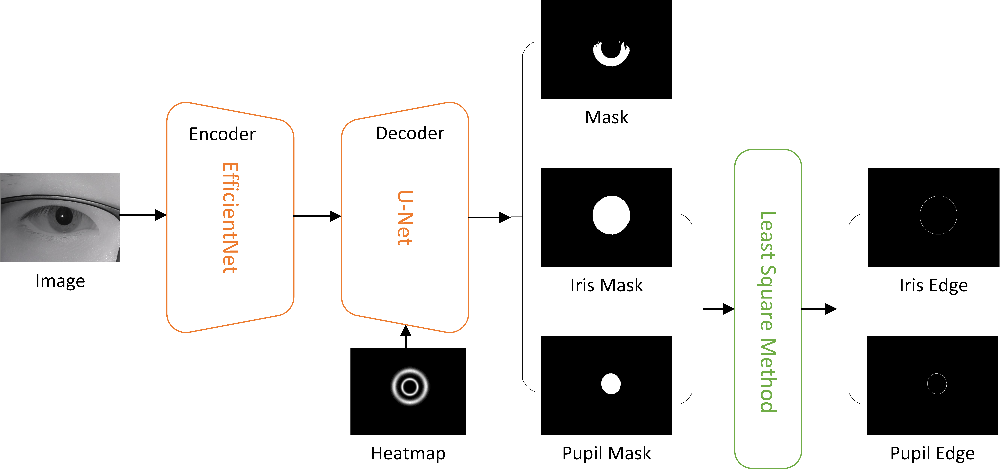

# The 3rd solution in NIR Iris Challenge Evaluation in Non-cooperative Environments: Segmentation and Localization (NIR-ISL 2021)


## Pipleline



## Requirement
python 3  
pytorch  
torchvision  
albumentations  
thop


## Model Evaluation
### complexity
For the model complexity, the number of model parameters, the size of model memory (measured in MB), the amount of floating point operations (measured in FLOPs w.r.t the input of 640×480 pixels), and the average running speed (w.r.t the input of 640×480 pixels and GPU/CPU computing devices) are evaluated.
|Model size(MB)  |params(M)   |Flops(G) |memory(MB) |speed(FPS) |
|:---------------|:-----------|:--------|:----------|:----------|
|282.97          |43.687      |55.521   |6807       |17.489     |

*Test on a single TITAN V*

### performance
For iris segmentation, the evaluation measures are type-I (E1) error rates (please refer to http://nice1.di.ubi.pt/evaluation.htm for more details), as used in the Noisy Iris Challenge Evaluation - Part I (NICE.I).  
For iris localization, the evaluation measures are dice index when filling the iris boundaries into iris boundary masks, and Hausdorff distance between the predicted iris boundaries and the corresponding ground truth boundaries. (please refer to https://warwick.ac.uk/fac/sci/dcs/research/tia/glascontest/evaluation/ for more details). 

|Dataset                        |E1(%)        |Dice       |Hausdorff   |
|:------------------------------|:------------|:----------|:-----------|
|CASIA-Iris-M1                  |0.7973       |0.9769     |0.0047      |
|CASIA-Iris-Africa              |0.4138       |0.9617     |0.0070      |
|CASIA-Iris-Distance            |0.3991       |0.9662     |0.0062      |
|CASIA-Iris-Complex-Off-angle   |0.3394       |0.9742     |0.0066      |
|CASIA-Iris-Complex-Occlusion   |0.4574       |0.9648     |0.0088      |

*Above are results of [model](https://pan.baidu.com/s/11zHhHryzhOhfJJ8NEPlv-g)* (password：x3zm)


## Getting Start

### Prepare dataset of NIR-ISL2021
Please refer to [mydataset.md](datasets/readme.md) for details to prepare dataset.

### Testing submitted model
1. Download [models](https://pan.baidu.com/s/11zHhHryzhOhfJJ8NEPlv-g) to './example'  (password：x3zm)  
2. run `python ./example/model_performance.py --dataset xxx --ckpath .../example/checkpoints/`  
*--dataset   Support dataset in [CASIA-Iris-Africa, CASIA-distance, Occlusion, Off_angle, CASIA-Iris-Mobile-V1.0]*  
*--ckpath    The folder path, which saves the models to get iris_mask, inner_boundary and outer_boundary respectively*  

### Training your model
please refer to [train.py](./train.py) default training parameters.
1. change *experiment_name* and *dataset_name* in train.py as you need
2. run `python ./train.py -e 64 -b 16 -l 0.02 --log my-experiment.log`

### Testing your model
```
python ./test.py \
--dataset CASIA-Iris-Africa\
--ckpath .../.../
```


## Contributor
Hao Zhang. EyeCool Research Center, College of Science, Northeastern University.

